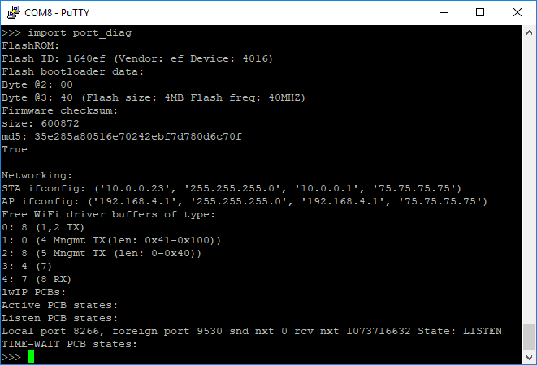

# labview-client-for-micropython
This is a client implemented in [LabVIEW](https://www.ni.com/en-za/shop/labview.html) that interacts with an embedded device or constrained system that runs micropython. Essentially, this target device runs Python code.

> [MicroPython](https://github.com/micropython/micropython)  - a lean and efficient Python implementation for microcontrollers and constrained systems 

## Introduction

This is a small library / client implemented in LabVIEW to interact with a target device running MicroPython.

>MicroPython is a project, that aims to put an implementation of Python 3.x on microcontrollers and small embedded systems. You can find the official website at [micropython.org](micropython.org).

Essentially, a library for micropython will use a serial port to interact with the target device running micropython. One requires nothing else than that. And, as such, a program like [Putty](https://www.putty.org/) can be used to open a serial communication session to the device and, pretty much, run python code / commands.

<figure align="center">
  
  <figcaption align="center"><small>Putty running on a laptop - And a Python REPL running on the remote device over serial port - The interactive prompt gives you control over the device and all its peripherals. And you can run Python Commands</small></figcaption>
     
</figure>

What this library makes easy is the integration in Test Systems. One such example is [TestStand](https://www.ni.com/en-za/shop/electronic-test-instrumentation/application-software-for-electronic-test-and-instrumentation-category/what-is-teststand.html) which is a popular Test Executive Software Suite and developed by [National Instrument](https://www.ni.com). 

As a matter of fact, this library was initially created for this very purpose. It is made available to speed up development of similar Systems.

## API

The Public API consists of 4 simple functions / VI:
- ``Initialize.vi``: To Initialize the comport
- ``Close.vi``: To close the comport
- ``SendCommand.vi``: Will send a command to the device and wait for its response
- ``UploadScript.vi``: Will take in a python script and send it over the serial port to the target device. ``SendCommand.vi`` can then be used to invoke functions and variables defined within this script.

## Getting Started

To get started, one needs some hardware running micropython. MicroPython requires a minimum 128K of Flash, 8K of RAM so not all arduino boards will support it (Officially [256k of code space and 16k of RAM](https://www.micropython.org/)). However, the [official github page](https://github.com/micropython/micropython) lists a few boards that will run micropython. 

The [PyBoard](https://github.com/micropython/pyboard) (running on a STM32F405xxxx) is the official board, but, alternatively, one can use the popular ``ESP32`` or the ``ESP8266`` as well.

Once Micropython is installed on your hardware, you can test that everything is working by opening a Serial Communication Session using [Putty](https://www.putty.org/) on the comport used by your board. 

The same operation can be reproduced using this library by calling ``Initialize.vi`` first, then ``SendCommand.vi`` and ``UploadScript.vi`` as necessary.

## Design

As stated previously, the library is written for LabVIEW and can be used with TestStand.
The following provides an overview of the of the LabVIEW VIs that make up the library:

- ``Initialize.vi``: To Initialize the comport

  

- ``Close.vi``: To close the comport

  

- ``SendCommand.vi``: Will send a command to the device and wait for its response

  

- ``UploadScript.vi``: Will take in a python script and send it over the serial port to the target device. ``SendCommand.vi`` can then be used to invoke functions and variables defined within this script.

  

``transmit`` and ``receive`` operations are handled by the VI ``TxRx.vi``. It will send a message to the target device and, optionally, wait, collect and aggregate response packets until some (stopping) conditions are met.

  

Similarily, TestStand will use the same set of steps to interact with a target device calling ``Initialize.vi`` as a setup action and ``Close.vi`` as a cleanup action. ``UploadScript.vi`` and ``SendCommand.vi`` will then be used to interact with the target.

  

The Screen snippet taken from the sample [TestStand Sequence File](./Examples/TestStand/Micropython.seq) provided in the repository.

## References

- https://github.com/micropython/micropython
- https://docs.micropython.org/en/latest/
- https://github.com/micropython/pyboard
- https://www.micropython.org/
